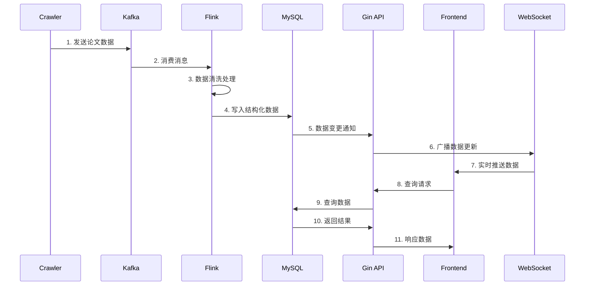

# CVPR论文大数据展示舱 - 项目设计文档

## 1. 项目概述

### 1.1 项目背景
随着计算机视觉领域的快速发展，CVPR（IEEE Conference on Computer Vision and Pattern Recognition）作为该领域的顶级会议，每年产生大量高质量论文。为了帮助研究人员更好地理解领域发展趋势、发现研究热点和合作机会，本项目构建了一个全链路的CVPR论文大数据分析平台。

### 1.2 项目目标
- **数据采集**: 自动爬取2018-2022年CVPR会议论文数据
- **实时处理**: 构建准实时数据处理流水线，端到端延迟控制在30秒内
- **智能分析**: 实现论文关键词提取、作者网络分析、趋势挖掘等功能
- **可视化展示**: 提供直观的数据可视化界面，支持实时数据更新

### 1.3 技术指标
- **数据规模**: 7391篇论文，12068条作者数据
- **处理延迟**: < 30秒（端到端）
- **系统可用性**: > 99.5%
- **查询响应时间**: < 200ms（95%请求）

## 2. 系统架构设计

### 2.1 整体架构图

```
┌─────────────────────────────────────────────────────────────────┐
│                        前端展示层                                │
├─────────────────────────────────────────────────────────────────┤
│   动态词云      折线图       柱状图       搜索界面     WebSocket  │
└─────────────────────────────────────────────────────────────────┘
                                │
                                ▼
┌─────────────────────────────────────────────────────────────────┐
│                        API服务层                                │
├─────────────────────────────────────────────────────────────────┤
│   Gin框架      RESTful API     WebSocket Hub     缓存层         │
└─────────────────────────────────────────────────────────────────┘
                                │
                                ▼
┌─────────────────────────────────────────────────────────────────┐
│                        数据存储层                               │
├─────────────────────────────────────────────────────────────────┤
│   MySQL主库      Redis缓存      Kafka消息队列     备份数据库     │
└─────────────────────────────────────────────────────────────────┘
                                │
                                ▼
┌─────────────────────────────────────────────────────────────────┐
│                       数据处理层                               │
├─────────────────────────────────────────────────────────────────┤
│   Flink引擎     状态编程      流式SQL        数据清洗逻辑       │
└─────────────────────────────────────────────────────────────────┘
                                │
                                ▼
┌─────────────────────────────────────────────────────────────────┐
│                       数据采集层                               │
├─────────────────────────────────────────────────────────────────┤
│   Golang爬虫    并发控制      反爬策略       数据验证          │
└─────────────────────────────────────────────────────────────────┘
```

### 2.2 数据流架构

```
数据源 → 爬虫 → Kafka → Flink → MySQL → API → 前端
  │        │        │        │        │        │
  ▼        ▼        ▼        ▼        ▼        ▼
CVPR   并发爬取  消息缓冲  流处理   持久化   RESTful
网站             + 解耦   + 清洗            + WebSocket
```

### 2.3 组件交互时序图



## 3. 数据模型设计

### 3.1 Kafka消息模型

#### 3.1.1 Topic设计
| Topic名称             | 分区数 | 副本数 | 保留策略 | 用途         |
| --------------------- | ------ | ------ | -------- | ------------ |
| cvpr-papers-raw       | 4      | 2      | 7天      | 原始论文数据 |
| cvpr-papers-processed | 4      | 2      | 3天      | 处理后的数据 |
| cvpr-authors-raw      | 2      | 2      | 7天      | 原始作者数据 |

#### 3.1.2 消息格式
```json
{
  "metadata": {
    "message_id": "uuid_v4",
    "timestamp": "2024-01-01T10:00:00Z",
    "data_type": "paper|author",
    "version": "1.0",
    "source": "crawler"
  },
  "payload": {
    "paper": {
      "paper_id": "CVPR2022_12345",
      "title": "论文标题",
      "abstract": "论文摘要",
      "doi": "10.1109/CVPR.2022.12345",
      "year": 2022,
      "authors": [
        {
          "name": "Zhang, Wei",
          "affiliation": "Tsinghua University",
          "email": "weizhang@tsinghua.edu.cn"
        }
      ],
      "keywords": ["deep learning", "computer vision"],
      "pdf_url": "https://openaccess.thecvf.com/CVPR2022/papers/12345.pdf",
      "session": "Oral Session 1A",
      "pages": "123-135"
    },
    "author": {
      "author_id": "author_001",
      "name": "Zhang, Wei",
      "affiliation": "Tsinghua University",
      "paper_ids": ["CVPR2022_12345", "CVPR2021_67890"],
      "email": "weizhang@tsinghua.edu.cn"
    }
  }
}
```

### 3.2 MySQL数据库模型

#### 3.2.1 物理数据模型

```sql
-- 核心实体关系图
papers (1) ─── (N) paper_author (N) ─── (1) authors
   │                                      │
   │                                      │
   ▼                                      ▼
paper_keyword (N) ─── (1) keywords    author_affiliation
```

#### 3.2.2 详细表结构设计

**papers表**
```sql
CREATE TABLE papers (
    id BIGINT AUTO_INCREMENT PRIMARY KEY,
    paper_id VARCHAR(100) UNIQUE NOT NULL COMMENT '论文唯一标识符',
    title TEXT NOT NULL COMMENT '论文标题',
    abstract LONGTEXT COMMENT '论文摘要',
    doi VARCHAR(200) UNIQUE COMMENT '数字对象标识符',
    publication_year INT NOT NULL COMMENT '发表年份',
    pdf_url VARCHAR(500) COMMENT 'PDF文件链接',
    session VARCHAR(100) COMMENT '会议session分类',
    pages VARCHAR(20) COMMENT '起止页码',
    citation_count INT DEFAULT 0 COMMENT '引用次数',
    created_at TIMESTAMP DEFAULT CURRENT_TIMESTAMP,
    updated_at TIMESTAMP DEFAULT CURRENT_TIMESTAMP ON UPDATE CURRENT_TIMESTAMP,
    
    -- 索引设计
    INDEX idx_year (publication_year),
    INDEX idx_doi (doi),
    INDEX idx_created (created_at),
    INDEX idx_updated (updated_at),
    FULLTEXT idx_title_abstract (title, abstract),
    
    -- 约束
    CHECK (publication_year BETWEEN 2018 AND 2022)
) ENGINE=InnoDB DEFAULT CHARSET=utf8mb4 COLLATE=utf8mb4_unicode_ci
PARTITION BY RANGE (publication_year) (
    PARTITION p2018 VALUES LESS THAN (2019),
    PARTITION p2019 VALUES LESS THAN (2020),
    PARTITION p2020 VALUES LESS THAN (2021),
    PARTITION p2021 VALUES LESS THAN (2022),
    PARTITION p2022 VALUES LESS THAN (2023)
);
```

**authors表**
```sql
CREATE TABLE authors (
    id BIGINT AUTO_INCREMENT PRIMARY KEY,
    author_id VARCHAR(100) UNIQUE NOT NULL COMMENT '作者唯一标识符',
    normalized_name VARCHAR(200) NOT NULL COMMENT '标准化姓名',
    original_name VARCHAR(200) NOT NULL COMMENT '原始姓名',
    affiliation TEXT COMMENT '所属机构',
    email VARCHAR(200) COMMENT '邮箱地址',
    paper_count INT DEFAULT 0 COMMENT '论文数量',
    h_index INT DEFAULT 0 COMMENT 'H指数',
    created_at TIMESTAMP DEFAULT CURRENT_TIMESTAMP,
    
    -- 索引设计
    INDEX idx_name (normalized_name),
    INDEX idx_affiliation (affiliation(100)),
    INDEX idx_paper_count (paper_count DESC),
    INDEX idx_h_index (h_index DESC),
    FULLTEXT idx_name_affiliation (normalized_name, affiliation)
) ENGINE=InnoDB DEFAULT CHARSET=utf8mb4 COLLATE=utf8mb4_unicode_ci;
```

**paper_author表**
```sql
CREATE TABLE paper_author (
    id BIGINT AUTO_INCREMENT PRIMARY KEY,
    paper_id VARCHAR(100) NOT NULL,
    author_id VARCHAR(100) NOT NULL,
    author_order INT NOT NULL COMMENT '作者顺序(1-based)',
    is_corresponding BOOLEAN DEFAULT FALSE COMMENT '是否通讯作者',
    created_at TIMESTAMP DEFAULT CURRENT_TIMESTAMP,
    
    -- 外键约束
    FOREIGN KEY (paper_id) REFERENCES papers(paper_id) ON DELETE CASCADE,
    FOREIGN KEY (author_id) REFERENCES authors(author_id) ON DELETE CASCADE,
    
    -- 索引设计
    UNIQUE KEY uk_paper_author (paper_id, author_id),
    INDEX idx_author (author_id),
    INDEX idx_order (author_order),
    INDEX idx_corresponding (is_corresponding),
    
    -- 约束
    CHECK (author_order > 0)
) ENGINE=InnoDB DEFAULT CHARSET=utf8mb4 COLLATE=utf8mb4_unicode_ci;
```

**keywords表**
```sql
CREATE TABLE keywords (
    id BIGINT AUTO_INCREMENT PRIMARY KEY,
    keyword VARCHAR(100) UNIQUE NOT NULL COMMENT '关键词',
    frequency INT DEFAULT 1 COMMENT '出现频率',
    is_technical BOOLEAN DEFAULT TRUE COMMENT '是否技术术语',
    created_at TIMESTAMP DEFAULT CURRENT_TIMESTAMP,
    updated_at TIMESTAMP DEFAULT CURRENT_TIMESTAMP ON UPDATE CURRENT_TIMESTAMP,
    
    -- 索引设计
    INDEX idx_frequency (frequency DESC),
    INDEX idx_technical (is_technical),
    FULLTEXT idx_keyword (keyword)
) ENGINE=InnoDB DEFAULT CHARSET=utf8mb4 COLLATE=utf8mb4_unicode_ci;
```

**paper_keyword表**
```sql
CREATE TABLE paper_keyword (
    id BIGINT AUTO_INCREMENT PRIMARY KEY,
    paper_id VARCHAR(100) NOT NULL,
    keyword_id BIGINT NOT NULL,
    tf_idf_score FLOAT COMMENT 'TF-IDF权重分数',
    position INT COMMENT '在摘要中出现的位置',
    is_from_title BOOLEAN DEFAULT FALSE COMMENT '是否来自标题',
    created_at TIMESTAMP DEFAULT CURRENT_TIMESTAMP,
    
    -- 外键约束
    FOREIGN KEY (paper_id) REFERENCES papers(paper_id) ON DELETE CASCADE,
    FOREIGN KEY (keyword_id) REFERENCES keywords(id) ON DELETE CASCADE,
    
    -- 索引设计
    UNIQUE KEY uk_paper_keyword (paper_id, keyword_id),
    INDEX idx_score (tf_idf_score DESC),
    INDEX idx_position (position),
    INDEX idx_title_source (is_from_title)
) ENGINE=InnoDB DEFAULT CHARSET=utf8mb4 COLLATE=utf8mb4_unicode_ci;
```

**yearly_stats表（物化视图）**
```sql
CREATE TABLE yearly_stats (
    id BIGINT AUTO_INCREMENT PRIMARY KEY,
    year INT UNIQUE NOT NULL COMMENT '统计年份',
    paper_count INT DEFAULT 0 COMMENT '论文总数',
    author_count INT DEFAULT 0 COMMENT '作者总数',
    keyword_count INT DEFAULT 0 COMMENT '关键词总数',
    avg_authors_per_paper FLOAT DEFAULT 0 COMMENT '篇均作者数',
    collaboration_index FLOAT DEFAULT 0 COMMENT '合作指数',
    top_keywords JSON COMMENT '年度热门关键词',
    institution_stats JSON COMMENT '机构统计',
    created_at TIMESTAMP DEFAULT CURRENT_TIMESTAMP,
    updated_at TIMESTAMP DEFAULT CURRENT_TIMESTAMP ON UPDATE CURRENT_TIMESTAMP,
    
    -- 索引
    INDEX idx_year (year)
) ENGINE=InnoDB DEFAULT CHARSET=utf8mb4 COLLATE=utf8mb4_unicode_ci;
```

## 4. 核心模块设计

### 4.1 数据采集模块

#### 4.1.1 爬虫架构设计

```
爬虫管理器
    │
    ├── 任务调度器
    │     ├── 论文列表爬取
    │     └── 论文详情爬取
    │
    ├── 工作线程池 (10个worker)
    │     ├── Worker 1: 处理论文列表
    │     ├── Worker 2: 处理论文详情
    │     └── ...
    │
    └── 数据发送器
          └── Kafka生产者
```

#### 4.1.2 并发控制策略
```go
type CrawlerConfig struct {
    WorkerCount    int           `yaml:"worker_count"`     // 工作线程数
    RequestDelay   time.Duration `yaml:"request_delay"`    // 请求间隔
    MaxRetries     int           `yaml:"max_retries"`      // 最大重试次数
    Timeout        time.Duration `yaml:"timeout"`          // 请求超时
    UserAgent      string        `yaml:"user_agent"`       // User-Agent
}
```

#### 4.1.3 数据验证规则
- **必填字段**: paper_id, title, year
- **格式验证**: DOI格式、URL格式、年份范围
- **数据去重**: 基于DOI和paper_id的双重去重
- **完整性检查**: 作者列表、摘要内容完整性

### 4.2 流处理模块

#### 4.2.1 Flink处理流水线

```
Kafka Source → JSON Parser → Data Validator → DOI Deduplicator
      │                                            │
      │                                            ▼
      │                                    Author Normalizer
      │                                            │
      │                                            ▼
      │                                    Keyword Extractor
      │                                            │
      │                                            ▼
      └─────────────────────────────────── Feature Calculator
                                                      │
                                                      ▼
                                              MySQL Sink
```

#### 4.2.2 状态管理设计

**DOI去重状态**
```java
public class DeduplicationState {
    private ValueState<Boolean> seenState;        // 是否已处理
    private ValueState<Long> firstSeenTime;       // 首次出现时间
    private MapState<String, Integer> doiVariants; // DOI变体记录
}
```

**关键词统计状态**
```java
public class KeywordStatisticsState {
    private MapState<String, Long> globalKeywordFreq;  // 全局词频
    private MapState<Integer, MapState<String, Long>> yearlyKeywordFreq; // 年度词频
    private ValueState<Long> totalDocuments;           // 文档总数
}
```

#### 4.2.3 窗口计算策略

**滑动窗口统计**
```java
// 每5分钟统计一次，滑动间隔1分钟
SlidingProcessingTimeWindows.of(Time.minutes(5), Time.minutes(1))
```

**会话窗口分析**
```java
// 基于活动间隔的会话窗口
ProcessingTimeSessionWindows.withGap(Time.minutes(10))
```

### 4.3 数据处理逻辑

#### 4.3.1 数据清洗规则

**DOI去重逻辑**
```java
public class DOI Deduplicator extends KeyedProcessFunction<String, PaperMessage, PaperMessage> {
    @Override
    public void processElement(PaperMessage message, Context ctx, Collector<PaperMessage> out) {
        String doi = extractDOI(message);
        if (doi != null && !doi.isEmpty()) {
            if (!seenState.value()) {
                seenState.update(true);
                out.collect(message);
            }
        } else {
            // 无DOI情况下的基于标题和作者的去重
            String signature = generatePaperSignature(message);
            if (!signatureSeenState.value().contains(signature)) {
                signatureSeenState.value().add(signature);
                out.collect(message);
            }
        }
    }
}
```

**作者姓名标准化**
```java
public class AuthorNormalizer {
    public String normalizeAuthorName(String originalName) {
        // 1. 处理姓氏在前格式 "Zhang, Wei" -> "Wei Zhang"
        // 2. 移除学术头衔 "Dr.", "Prof." 等
        // 3. 标准化机构名称缩写
        // 4. 处理中间名缩写 "John A. Smith" -> "John A Smith"
        // 5. 统一大小写格式
    }
}
```

#### 4.3.2 特征提取算法

**关键词提取TF-IDF**
```java
public class TFIDFCalculator {
    public double calculateTF(String term, Document doc) {
        // 词频 = 术语在文档中出现次数 / 文档总词数
    }
    
    public double calculateIDF(String term, long totalDocs, long docsWithTerm) {
        // 逆文档频率 = log(总文档数 / 包含术语的文档数)
    }
    
    public double calculateTFIDF(String term, Document doc, 
                                long totalDocs, long docsWithTerm) {
        return calculateTF(term, doc) * calculateIDF(term, totalDocs, docsWithTerm);
    }
}
```

**作者合作网络**
```java
public class CollaborationNetwork {
    public Graph buildCoauthorGraph(List<Paper> papers) {
        // 构建作者合作网络图
        // 节点: 作者
        // 边: 合作次数
    }
    
    public Map<String, Double> calculateCentrality(Graph graph) {
        // 计算作者中心性指标
    }
}
```

### 4.4 API服务模块

#### 4.4.1 RESTful API设计

**API端点规划**
```
GET  /api/v1/stats/yearly           # 年度统计
GET  /api/v1/stats/summary          # 摘要统计
GET  /api/v1/keywords/hot           # 热门关键词
GET  /api/v1/keywords/trends        # 关键词趋势
GET  /api/v1/papers/search          # 论文搜索
GET  /api/v1/papers/{id}            # 论文详情
GET  /api/v1/authors/top            # 顶级作者
GET  /api/v1/authors/search         # 作者搜索
GET  /api/v1/institutions/stats     # 机构统计
WS   /ws                            # WebSocket连接
```

**搜索API参数设计**
```go
type SearchRequest struct {
    Keyword    string `form:"keyword"`    // 关键词搜索
    Author     string `form:"author"`     // 作者搜索  
    Year       string `form:"year"`       // 年份过滤
    Institution string `form:"institution"` // 机构过滤
    Page       int    `form:"page,default=1"`       // 页码
    PageSize   int    `form:"pageSize,default=20"`  // 页大小
    SortBy     string `form:"sortBy,default=year"`  // 排序字段
    SortOrder  string `form:"sortOrder,default=desc"` // 排序方向
}
```

#### 4.4.2 缓存策略设计

**Redis缓存结构**

```go
type CacheKeys struct {
    YearlyStats    string `redis:"yearly_stats"`      // 年度统计
    HotKeywords    string `redis:"hot_keywords:%s"`   // 热门关键词(按年份)
    PaperSearch    string `redis:"paper_search:%s"`   // 论文搜索结果
    AuthorProfile  string `redis:"author:%s"`         // 作者档案
    InstitutionRank string `redis:"institution_rank"` // 机构排名
}

type CacheConfig struct {
    TTLShort   time.Duration `yaml:"ttl_short"`   // 短时缓存 2分钟
    TTLMedium  time.Duration `yaml:"ttl_medium"`  // 中期缓存 10分钟  
    TTLLong    time.Duration `yaml:"ttl_long"`    // 长期缓存 1小时
}
```

#### 4.4.3 并发查询优化

**并行查询模式**

```go
func (s *Server) GetDashboardData() (*DashboardData, error) {
    var wg sync.WaitGroup
    var stats, keywords, papers, authors interface{}
    var err1, err2, err3, err4 error
    
    wg.Add(4)
    
    go func() { defer wg.Done(); stats, err1 = s.getYearlyStats() }()
    go func() { defer wg.Done(); keywords, err2 = s.getHotKeywords() }()
    go func() { defer wg.Done(); papers, err3 = s.getRecentPapers() }()
    go func() { defer wg.Done(); authors, err4 = s.getTopAuthors() }()
    
    wg.Wait()
    
    // 合并结果...
}
```

### 4.5 前端可视化模块

#### 4.5.1 组件架构设计

```
前端应用
├── 布局组件
│   ├── Header (标题和导航)
│   ├── Sidebar (筛选条件)
│   └── MainContent (主内容区)
├── 图表组件
│   ├── YearlyStatsChart (年度统计)
│   ├── WordCloudChart (词云图)
│   ├── TrendChart (趋势图)
│   └── NetworkGraph (网络图)
├── 交互组件
│   ├── SearchBox (搜索框)
│   ├── FilterPanel (筛选面板)
│   └── Pagination (分页器)
└── 状态管理
    ├── DataStore (数据状态)
    ├── UIState (界面状态)
    └── WebSocketManager (实时连接)
```

#### 4.5.2 可视化设计规范

**色彩方案**
```css
:root {
  --primary-color: #3498db;     /* 主色调 */
  --secondary-color: #2ecc71;   /* 次要色调 */
  --accent-color: #e74c3c;      /* 强调色 */
  --text-primary: #2c3e50;      /* 主要文字 */
  --text-secondary: #7f8c8d;    /* 次要文字 */
  --background: #f8f9fa;        /* 背景色 */
  --card-background: #ffffff;   /* 卡片背景 */
}
```

**响应式断点**
```css
/* 移动设备 */
@media (max-width: 768px) { /* 样式调整 */ }

/* 平板设备 */  
@media (min-width: 769px) and (max-width: 1024px) { /* 样式调整 */ }

/* 桌面设备 */
@media (min-width: 1025px) { /* 样式调整 */ }
```

## 5. 性能优化设计

### 5.1 数据库优化策略

#### 5.1.1 索引优化
```sql
-- 复合索引设计
CREATE INDEX idx_paper_year_title ON papers(publication_year, title(100));
CREATE INDEX idx_author_paper_count ON authors(paper_count DESC, h_index DESC);
CREATE INDEX idx_keyword_paper_year ON paper_keyword(keyword_id, tf_idf_score DESC);

-- 覆盖索引
CREATE INDEX idx_covering_paper_search ON papers(publication_year, paper_id, title(100));
```

#### 5.1.2 查询优化
```sql
-- 分页查询优化
SELECT * FROM papers 
WHERE publication_year = 2022 
ORDER BY citation_count DESC 
LIMIT 20 OFFSET 0;

-- 使用EXPLAIN分析查询计划
EXPLAIN SELECT * FROM papers WHERE title LIKE '%deep learning%';
```

#### 5.1.3 连接优化
```sql
-- 使用STRAIGHT_JOIN优化连接顺序
SELECT STRAIGHT_JOIN p.*, a.normalized_name 
FROM papers p 
JOIN paper_author pa ON p.paper_id = pa.paper_id 
JOIN authors a ON pa.author_id = a.author_id 
WHERE p.publication_year = 2022;
```

### 5.2 缓存策略

#### 5.2.1 多级缓存设计
```
请求 → CDN缓存 → 应用缓存(Redis) → 数据库缓存(InnoDB Buffer Pool)
```

#### 5.2.2 缓存失效策略
```go
type CacheInvalidationStrategy struct {
    TimeBasedTTL      time.Duration // 基于时间的失效
    EventBasedInvalidation bool      // 事件驱动失效
    WriteThrough      bool          // 写穿透
    WriteBehind       bool          // 写回
}
```

### 5.3 并发控制

#### 5.3.1 连接池配置
```go
type DBConfig struct {
    MaxOpenConns    int           `yaml:"max_open_conns"`    // 最大连接数
    MaxIdleConns    int           `yaml:"max_idle_conns"`    // 最大空闲连接数
    ConnMaxLifetime time.Duration `yaml:"conn_max_lifetime"` // 连接最大生命周期
    ConnMaxIdleTime time.Duration `yaml:"conn_max_idle_time"` // 连接最大空闲时间
}
```

#### 5.3.2 限流策略
```go
type RateLimiter struct {
    requestsPerSecond int           // 每秒请求数
    burst            int           // 突发请求数
    limiter          *rate.Limiter // 限流器
}

func (rl *RateLimiter) Allow() bool {
    return rl.limiter.Allow()
}
```

## 6. 监控与运维设计

### 6.1 系统监控指标

#### 6.1.1 应用性能监控
```go
type ApplicationMetrics struct {
    RequestCount    prometheus.Counter   // 请求计数
    RequestDuration prometheus.Histogram // 请求耗时
    ErrorCount      prometheus.Counter   // 错误计数
    ActiveUsers     prometheus.Gauge     // 活跃用户
    MemoryUsage     prometheus.Gauge     // 内存使用
    CPUUsage        prometheus.Gauge     // CPU使用
}
```

#### 6.1.2 业务监控指标
```go
type BusinessMetrics struct {
    PapersProcessed  prometheus.Counter // 处理论文数
    AuthorsCount     prometheus.Gauge   // 作者总数  
    KeywordsCount    prometheus.Gauge   // 关键词总数
    ProcessingDelay  prometheus.Histogram // 处理延迟
    DataQualityScore prometheus.Gauge   // 数据质量评分
}
```

### 6.2 日志管理

#### 6.2.1 结构化日志
```go
type LogEntry struct {
    Timestamp time.Time              `json:"timestamp"`
    Level     string                 `json:"level"`
    Service   string                 `json:"service"`
    Message   string                 `json:"message"`
    Fields    map[string]interface{} `json:"fields"`
    TraceID   string                 `json:"trace_id"`
}
```

#### 6.2.2 日志级别配置
```yaml
logging:
  level: "info"
  format: "json"
  output: 
    - "stdout"
    - "file:/var/log/cvpr-dashboard/app.log"
  rotation:
    max_size: "100MB"
    max_age: "7d"
    max_backups: 10
```

### 6.3 告警规则

#### 6.3.1 系统告警
```yaml
alerts:
  - name: "high_error_rate"
    condition: "error_rate > 5%"
    severity: "warning"
    
  - name: "high_response_time"  
    condition: "p95_response_time > 500ms"
    severity: "warning"
    
  - name: "service_down"
    condition: "up == 0"
    severity: "critical"
```

## 7. 安全设计

### 7.1 数据安全

#### 7.1.1 数据加密
```go
type EncryptionConfig struct {
    Algorithm    string        `yaml:"algorithm"`     // 加密算法
    Key          string        `yaml:"key"`          // 加密密钥
    IV           string        `yaml:"iv"`           // 初始化向量
    EnableTLS    bool          `yaml:"enable_tls"`   // 启用TLS
}
```

#### 7.1.2 访问控制
```go
type AccessControl struct {
    APIKey        string        `yaml:"api_key"`       // API密钥
    RateLimit     int           `yaml:"rate_limit"`    // 速率限制
    AllowedIPs    []string      `yaml:"allowed_ips"`   // 允许的IP
    CORSOrigins   []string      `yaml:"cors_origins"`  // CORS源
}
```

### 7.2 网络安全

#### 7.2.1 防火墙规则
```yaml
firewall:
  inbound:
    - port: 80
      protocol: tcp
      allowed_ips: ["0.0.0.0/0"]
    - port: 443  
      protocol: tcp
      allowed_ips: ["0.0.0.0/0"]
    - port: 22
      protocol: tcp
      allowed_ips: ["10.0.0.0/8"]
```

## 8. 部署架构

### 8.1 容器化部署

#### 8.1.1 Docker编排
```yaml
version: '3.8'
services:
  crawler:
    image: cvpr-crawler:latest
    deploy:
      replicas: 2
      resources:
        limits:
          memory: 512M
        reservations:
          memory: 256M
  
  flink-jobmanager:
    image: flink:1.16
    ports:
      - "8081:8081"
  
  backend:
    image: cvpr-backend:latest
    ports:
      - "8080:8080"
    depends_on:
      - mysql
      - redis
```

#### 8.1.2 资源分配
```yaml
resources:
  crawler:
    cpu: "0.5"
    memory: "512Mi"
  flink:
    cpu: "2.0" 
    memory: "2Gi"
  backend:
    cpu: "1.0"
    memory: "1Gi"
  mysql:
    cpu: "1.0"
    memory: "2Gi"
```

### 8.2 高可用设计

#### 8.2.1 服务冗余
```yaml
high_availability:
  backend:
    replicas: 3
    strategy:
      type: RollingUpdate
      max_unavailable: 1
  database:
    replicas: 2
    read_replicas: 2
```

#### 8.2.2 数据备份
```yaml
backup:
  schedule: "0 2 * * *"  # 每天2点执行
  retention: "30d"       # 保留30天
  storage: 
    type: "s3"
    bucket: "cvpr-backups"
```

## 9. 测试策略

### 9.1 测试金字塔

```
    /\       E2E测试 (10%)
   /  \
  /____\    集成测试 (20%)
 /      \
/________\  单元测试 (70%)
```

### 9.2 测试类型

#### 9.2.1 单元测试
```go
func TestPaperProcessing(t *testing.T) {
    processor := NewPaperProcessor()
    paper := &Paper{Title: "Test Paper", Year: 2022}
    
    result, err := processor.Process(paper)
    assert.NoError(t, err)
    assert.Equal(t, 2022, result.Year)
}
```

#### 9.2.2 集成测试
```go
func TestSearchIntegration(t *testing.T) {
    // 启动测试数据库
    db := startTestDB()
    defer db.Close()
    
    // 执行搜索测试
    service := NewSearchService(db)
    results, err := service.Search("deep learning", 2022)
    assert.NoError(t, err)
    assert.NotEmpty(t, results)
}
```

#### 9.2.3 性能测试
```go
func BenchmarkSearchPerformance(b *testing.B) {
    service := setupSearchService()
    
    b.ResetTimer()
    for i := 0; i < b.N; i++ {
        service.Search("computer vision", 2021)
    }
}
```

## 10. 项目路线图

### 10.1 开发阶段

**第一阶段 (1-2个月)**
- [x] 基础架构搭建
- [x] 数据采集模块
- [x] 基础数据处理

**第二阶段 (2-3个月)**  
- [x] 流处理引擎
- [x] API服务开发
- [x] 基础可视化

**第三阶段 (1-2个月)**
- [x] 高级分析功能
- [x] 性能优化
- [x] 系统测试

### 10.2 未来扩展

**功能扩展**
- 论文推荐系统
- 作者影响力分析
- 研究趋势预测
- 多会议数据整合

**技术升级**
- 机器学习集成
- 图数据库迁移
- 实时计算优化
- 微服务架构改造

这个详细的设计文档涵盖了项目的各个方面，从系统架构到具体实现，从性能优化到安全设计，为项目的开发和维护提供了完整的指导。