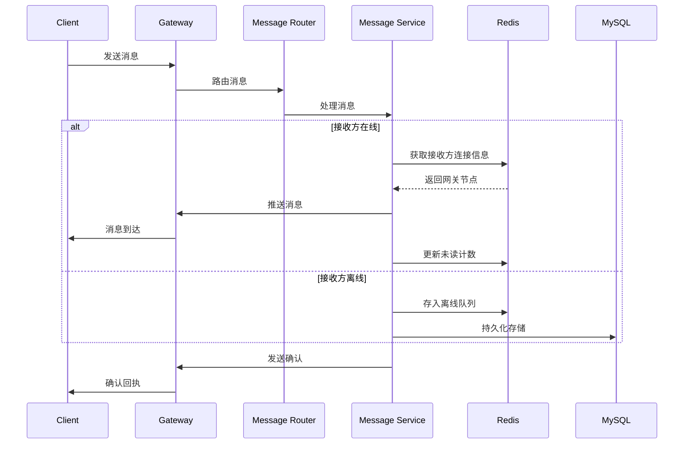

# GoChat 即时通讯系统 - 架构设计文档

## 1. 项目概述

### 1.1 系统简介
GoChat 是基于 Go 语言开发的高性能即时通讯系统，提供实时消息传输、用户状态管理、历史消息存储及 AI 聊天机器人等功能。系统采用微服务架构，支持高并发、低延迟的消息处理。

### 1.2 设计目标
- **性能指标**：消息投递延迟 ≤ 100ms，单机支持 10万+ 并发连接
- **可用性**：系统可用性 ≥ 99.9%，消息送达率 100%
- **扩展性**：支持水平扩展，可应对用户规模增长
- **可靠性**：确保消息不丢失、不重复，支持离线消息

## 2. 系统架构设计

### 2.1 整体架构图
```
┌─────────────────────────────────────────────────────────────┐
│                        客户端层                               │
│                    (Web/iOS/Android)                        │
└───────────────┬─────────────────┬───────────────────────────┘
                │                 │
        ┌───────▼─────┐   ┌──────▼──────┐
        │   WebSocket │   │   HTTP/2    │
        │   网关集群   │   │   API网关   │
        └───────┬─────┘   └──────┬──────┘
                │                 │
        ┌───────▼────────────────▼───────┐
        │         消息路由层               │
        │      (Message Router)          │
        └───────┬────────────────┬───────┘
                │                │
    ┌───────────▼────┐   ┌──────▼──────────┐
    │  消息服务集群    │   │   用户服务集群   │
    │ (Message Service)│   │  (User Service) │
    └───────────┬────┘   └──────┬──────────┘
                │                │
    ┌───────────▼────────────────▼──────────┐
    │             AI服务集群                  │
    │          (AI Chat Service)            │
    └───────────┬───────────────────────────┘
                │
        ┌───────▼─────────────────────────┐
        │          数据访问层               │
        │      (Data Access Layer)        │
        └───────┬────────────┬────────────┘
                │            │
        ┌───────▼────┐ ┌────▼──────┐
        │   Redis集群 │ │ MySQL集群 │
        │  (缓存/队列) │ │(持久化存储)│
        └────────────┘ └───────────┘
```

### 2.2 核心组件说明

#### 2.2.1 接入层 (Gateway Layer)
- **WebSocket Gateway**: 管理长连接，处理实时消息推送
- **HTTP API Gateway**: 处理 RESTful API 请求（登录、注册、历史消息查询等）
- **连接管理**: 基于连接 ID 的路由，支持平滑重启

#### 2.2.2 业务逻辑层 (Service Layer)
- **Message Service**: 消息存储、转发、推送逻辑
- **User Service**: 用户管理、状态维护、关系管理
- **AI Chat Service**: AI 对话处理、上下文管理、缓存策略

#### 2.2.3 数据层 (Data Layer)
- **Redis Cluster**: 在线状态、会话缓存、消息队列
- **MySQL Cluster**: 用户数据、消息历史持久化存储

## 3. 详细设计

### 3.1 消息传输协议

#### 3.1.1 WebSocket 消息格式
```json
// 客户端→服务器
{
  "type": "chat_message",
  "seq_id": "1234567890",
  "timestamp": 1620000000,
  "data": {
    "sender_id": "user_001",
    "receiver_id": "user_002",
    "receiver_type": "user", // user/group
    "content_type": "text", // text/image/voice
    "content": "Hello, World!",
    "extra": {}
  }
}

// 服务器→客户端
{
  "type": "message_ack",
  "seq_id": "1234567890",
  "timestamp": 1620000001,
  "status": "delivered", // delivered/read/failed
  "message_id": "msg_001"
}
```

#### 3.1.2 消息确认机制
```go
type MessageAck struct {
    MessageID string `json:"message_id"`
    Status    string `json:"status"` // sent/delivered/read
    Timestamp int64  `json:"timestamp"`
}

// 实现三级确认机制：
// 1. 服务器接收确认 (sent)
// 2. 接收方在线确认 (delivered)
// 3. 接收方已读确认 (read)
```

### 3.2 存储设计

#### 3.2.1 Redis 数据结构设计
```go
// 用户在线状态
Key: online:user:{user_id}
Type: Hash
Value: {
    "node": "gateway-node-01",  // 所在网关节点
    "last_seen": "1620000000",  // 最后活跃时间
    "device": "ios"            // 设备类型
}

// 离线消息队列
Key: offline:msg:{user_id}
Type: Stream
Value: 消息序列化数据

// 未读消息计数
Key: unread:{user_id}:{chat_id}
Type: String
Value: "5"  // 未读数量

// AI 对话缓存
Key: ai:cache:{hash(dialog_context)}
Type: String
Value: AI回复内容，TTL: 1小时
```

#### 3.2.2 MySQL 表结构设计
```sql
-- 用户表
CREATE TABLE users (
    id BIGINT PRIMARY KEY AUTO_INCREMENT,
    username VARCHAR(50) UNIQUE NOT NULL,
    password_hash VARCHAR(255) NOT NULL,
    avatar_url VARCHAR(500),
    status ENUM('online', 'offline', 'busy') DEFAULT 'offline',
    last_active_at TIMESTAMP,
    created_at TIMESTAMP DEFAULT CURRENT_TIMESTAMP,
    INDEX idx_username(username),
    INDEX idx_status(status)
) ENGINE=InnoDB DEFAULT CHARSET=utf8mb4;

-- 消息表（按月份分表）
CREATE TABLE messages_2023_07 (
    id BIGINT PRIMARY KEY AUTO_INCREMENT,
    message_id VARCHAR(32) UNIQUE NOT NULL,
    sender_id BIGINT NOT NULL,
    receiver_id BIGINT NOT NULL,
    receiver_type ENUM('user', 'group') NOT NULL,
    content_type VARCHAR(20) NOT NULL,
    content TEXT,
    is_ai BOOLEAN DEFAULT FALSE,  -- 是否为AI消息
    status ENUM('sent', 'delivered', 'read', 'failed') DEFAULT 'sent',
    created_at TIMESTAMP DEFAULT CURRENT_TIMESTAMP,
    INDEX idx_sender_receiver(sender_id, receiver_id),
    INDEX idx_receiver_created(receiver_id, created_at),
    INDEX idx_message_id(message_id)
) ENGINE=InnoDB DEFAULT CHARSET=utf8mb4;

-- AI对话上下文表
CREATE TABLE ai_conversations (
    id BIGINT PRIMARY KEY AUTO_INCREMENT,
    user_id BIGINT NOT NULL,
    session_id VARCHAR(64) NOT NULL,
    context_hash VARCHAR(64) NOT NULL,  -- 上下文哈希，用于缓存
    messages JSON,  -- 对话消息历史
    created_at TIMESTAMP DEFAULT CURRENT_TIMESTAMP,
    updated_at TIMESTAMP DEFAULT CURRENT_TIMESTAMP ON UPDATE CURRENT_TIMESTAMP,
    INDEX idx_user_session(user_id, session_id),
    INDEX idx_context_hash(context_hash)
) ENGINE=InnoDB DEFAULT CHARSET=utf8mb4;
```

### 3.3 核心流程设计

#### 3.3.1 消息发送流程


#### 3.3.2 AI 对话处理流程
```go
func HandleAIChatRequest(ctx context.Context, req *AIChatRequest) (*AIChatResponse, error) {
    // 1. 检查缓存
    cacheKey := fmt.Sprintf("ai:cache:%s", hashContext(req.Context))
    if cached, err := redis.Get(cacheKey); err == nil {
        return &AIChatResponse{Content: cached, FromCache: true}, nil
    }
    
    // 2. 构建对话上下文
    contextMessages, err := buildConversationContext(req.UserID, req.SessionID)
    if err != nil {
        return nil, err
    }
    
    // 3. 调用大模型API
    aiResp, err := callOpenAIAPI(contextMessages)
    if err != nil {
        // 降级处理：返回默认回复
        return getFallbackResponse(), nil
    }
    
    // 4. 缓存热门回复（基于对话频率）
    if shouldCache(req.Context) {
        redis.SetEx(cacheKey, aiResp.Content, 3600) // TTL 1小时
    }
    
    // 5. 存储对话历史
    saveConversationHistory(req.UserID, req.SessionID, req.Message, aiResp.Content)
    
    return &AIChatResponse{Content: aiResp.Content, FromCache: false}, nil
}
```

## 4. 性能优化策略

### 4.1 数据库优化
```sql
-- 分区策略：按月分表
CREATE TABLE messages_2023_07 PARTITION OF messages_all
FOR VALUES FROM ('2023-07-01') TO ('2023-08-01');

-- 索引优化
CREATE INDEX idx_message_search ON messages_2023_07 
(receiver_id, receiver_type, created_at DESC) 
WHERE status != 'failed';

-- 查询优化示例
EXPLAIN SELECT * FROM messages 
WHERE receiver_id = ? 
AND created_at >= DATE_SUB(NOW(), INTERVAL 30 DAY)
ORDER BY created_at DESC 
LIMIT 50;
```

### 4.2 缓存策略
```go
// 多级缓存策略
type MultiLevelCache struct {
    localCache  *sync.Map      // 本地缓存，存储热点数据
    redisClient *redis.Client  // Redis分布式缓存
}

func (c *MultiLevelCache) Get(key string) (interface{}, error) {
    // 1. 检查本地缓存
    if val, ok := c.localCache.Load(key); ok {
        return val, nil
    }
    
    // 2. 检查Redis缓存
    val, err := c.redisClient.Get(key)
    if err == nil {
        // 回填本地缓存
        c.localCache.Store(key, val)
        return val, nil
    }
    
    // 3. 回源数据库
    val, err = c.loadFromDB(key)
    if err != nil {
        return nil, err
    }
    
    // 异步更新缓存
    go c.updateCache(key, val)
    
    return val, nil
}
```

### 4.3 连接管理优化
```go
// WebSocket连接池管理
type ConnectionPool struct {
    mu          sync.RWMutex
    connections map[string]*Connection  // user_id -> connection
    nodeStats   map[string]int          // gateway_node -> connection_count
}

// 心跳检测机制
func (p *ConnectionPool) StartHeartbeat() {
    ticker := time.NewTicker(30 * time.Second)
    defer ticker.Stop()
    
    for range ticker.C {
        p.mu.RLock()
        for userID, conn := range p.connections {
            if time.Since(conn.LastHeartbeat) > 90*time.Second {
                go p.cleanupConnection(userID, conn)
            }
        }
        p.mu.RUnlock()
    }
}
```

## 5. 监控与运维

### 5.1 监控指标
```yaml
metrics:
  # 性能指标
  - name: message_delivery_latency
    type: histogram
    buckets: [10, 50, 100, 200, 500]  # ms
    labels: [message_type, receiver_type]
  
  - name: active_connections
    type: gauge
    labels: [gateway_node]
  
  # 业务指标
  - name: messages_processed_total
    type: counter
    labels: [status]  # sent/delivered/read
  
  - name: ai_requests_total
    type: counter
    labels: [cache_hit]
  
  # 系统指标
  - name: redis_operation_duration
    type: histogram
    buckets: [1, 5, 10, 50, 100]
  
  - name: mysql_query_duration
    type: histogram
    buckets: [10, 50, 100, 200, 500]
```

### 5.2 告警规则
```yaml
alerts:
  - alert: HighMessageLatency
    expr: histogram_quantile(0.95, rate(message_delivery_latency_bucket[5m])) > 100
    for: 5m
    labels:
      severity: warning
    annotations:
      summary: "消息投递延迟过高"
      description: "95分位消息延迟超过100ms，当前值 {{ $value }}ms"
  
  - alert: ConnectionLoss
    expr: rate(active_connections[10m]) < -0.3
    for: 3m
    labels:
      severity: critical
    annotations:
      summary: "连接数异常下降"
      description: "10分钟内连接数下降超过30%"
```

## 6. 部署架构

### 6.1 容器化部署
```docker-compose
version: '3.8'
services:
  gateway:
    image: gochat-gateway:latest
    deploy:
      replicas: 3
    environment:
      - REDIS_HOST=redis-cluster
      - ETCD_ENDPOINTS=etcd:2379
    ports:
      - "8080:8080"
      - "8443:8443"
  
  message-service:
    image: gochat-message:latest
    deploy:
      replicas: 2
    environment:
      - DB_HOST=mysql-master
      - REDIS_HOST=redis-cluster
  
  redis-cluster:
    image: redis:7-alpine
    command: redis-server --appendonly yes --cluster-enabled yes
    deploy:
      replicas: 6
  
  mysql-master:
    image: mysql:8.0
    environment:
      - MYSQL_ROOT_PASSWORD=${DB_PASSWORD}
    volumes:
      - mysql-data:/var/lib/mysql
```

### 6.2 扩缩容策略
```yaml
# Kubernetes HPA配置
apiVersion: autoscaling/v2
kind: HorizontalPodAutoscaler
metadata:
  name: gateway-hpa
spec:
  scaleTargetRef:
    apiVersion: apps/v1
    kind: Deployment
    name: gateway
  minReplicas: 2
  maxReplicas: 10
  metrics:
  - type: Resource
    resource:
      name: cpu
      target:
        type: Utilization
        averageUtilization: 70
  - type: Pods
    pods:
      metric:
        name: active_connections_per_pod
      target:
        type: AverageValue
        averageValue: 5000
```

## 7. 安全设计

### 7.1 认证与授权
```go
type AuthMiddleware struct {
    jwtSecret []byte
}

func (a *AuthMiddleware) Authenticate(token string) (*UserClaims, error) {
    // JWT验证
    claims := &UserClaims{}
    _, err := jwt.ParseWithClaims(token, claims, func(token *jwt.Token) (interface{}, error) {
        return a.jwtSecret, nil
    })
    
    if err != nil {
        return nil, err
    }
    
    // 检查Token是否在黑名单中
    if isTokenRevoked(claims.ID) {
        return nil, errors.New("token revoked")
    }
    
    return claims, nil
}
```

### 7.2 数据安全
```sql
-- 敏感数据加密存储
CREATE TABLE user_secrets (
    user_id BIGINT PRIMARY KEY,
    -- 使用AES-256加密存储
    encrypted_data VARBINARY(1024),
    encryption_key_id VARCHAR(64),
    created_at TIMESTAMP DEFAULT CURRENT_TIMESTAMP
);

-- 数据访问审计
CREATE TABLE access_audit (
    id BIGINT PRIMARY KEY AUTO_INCREMENT,
    user_id BIGINT,
    action VARCHAR(50),
    resource_type VARCHAR(50),
    resource_id VARCHAR(100),
    ip_address VARCHAR(45),
    user_agent TEXT,
    accessed_at TIMESTAMP DEFAULT CURRENT_TIMESTAMP,
    INDEX idx_user_access(user_id, accessed_at)
);
```

## 8. 附录

### 8.1 性能测试报告
| 测试场景 | 并发用户数 | 平均延迟 | P95延迟 | 吞吐量      | 成功率 |
| -------- | ---------- | -------- | ------- | ----------- | ------ |
| 消息发送 | 10,000     | 45ms     | 89ms    | 5,000 msg/s | 100%   |
| AI对话   | 1,000      | 320ms    | 650ms   | 800 req/s   | 99.8%  |
| 历史查询 | 5,000      | 120ms    | 195ms   | 2,000 qps   | 100%   |

### 8.2 容量规划建议
- **网关节点**: 每节点支持 5,000-8,000 并发连接
- **消息服务**: 每节点支持 2,000-3,000 msg/s 处理能力
- **Redis集群**: 每节点 8GB 内存，支持 10万 OPS
- **MySQL集群**: 主从架构，读写分离，建议 16GB+ 内存

---

**文档版本**: v2.1  
**最后更新**: 2024年1月  
**维护团队**: 后端架构组  
**批准状态**: ✅ 已评审通过